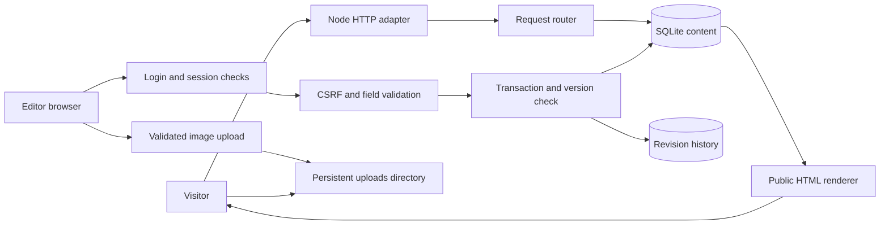

# How the website fits together

This guide is for the next person maintaining the site. Read [the quick start](../README.md) first, then use the sections below to trace an actual request or change.

## Two deliverables

1. **The Node/Docker application** is the editable website. Its public pages are rendered from SQLite on each request. Its `/admin` editor updates that same database, so routine publishing needs no build or redeploy.
2. **The static preview** is a generated snapshot for design review. It contains public HTML/CSS/JavaScript and original image URLs. It has no editor or database. Re-export and republish the snapshot to refresh it. Sites hosts this snapshot; Docker hosts the complete application.

Do not confuse the static preview with a deployed CMS. SQLite and editor accounts never go into the static archive.

## Request and publishing flow



A news update takes this path:

1. `public/admin.js` loads field definitions and records from `/admin/api/session` and `/admin/api/records`.
2. The editor fills in the same fields for every news item. Rich text is edited through formatting controls, not HTML code.
3. Saving sends `{ record, version }` to `/admin/api/records` with the session cookie and CSRF header.
4. `src/app.mjs` verifies the origin, session and CSRF token, copies editable fields only, and sanitizes rich text.
5. `src/content.mjs` validates field sizes, URLs, status, identity and route constraints.
6. `src/store.mjs` starts a transaction, compares `version`, stores the record and a revision together, and commits. A stale version produces HTTP 409; it does not overwrite newer work.
7. The next public request reads published records and renders the new information through the same template. Drafts are excluded.

## File map

| File | Responsibility | Main interface |
|---|---|---|
| `src/server.mjs` | Binds a port; converts Node HTTP requests/responses to Web Request/Response objects; seeds a new database; shuts down cleanly | `npm start` |
| `src/app.mjs` | Routes HTTP, enforces editor access, serves allowlisted assets and images, returns security headers | `createApp({ store, origin, dataDir, production })` → async handler |
| `src/store.mjs` | SQLite records, revisions, accounts, sessions, rate-limit counters, transactions and backups | `Store` |
| `src/content.mjs` | Collections, field metadata, editor field order and record validation | `FIELDS`, `COLLECTION_FIELDS`, `validateRecord()` |
| `src/media.mjs` | Media library: every image (uploads, built-in copies, remote URLs) with where it is used; replace everywhere; copy Raikou images into storage | `mediaLibrary()`, `replaceEverywhere()`, `importRemote()` |
| `src/security.mjs` | Password hashing, constant-time comparisons, URL checks, HTML escaping and rich-text allowlist | `hashPassword()`, `verifyPassword()`, `safeUrl()`, `sanitizeHtml()` |
| `src/uploads.mjs` | Bounded body reads, accepted image signatures and generated upload names | `readLimited()`, `saveImage()`, `uploadedImage()` |
| `src/render.mjs` | Document shell, router and page templates: research, people and profiles, publications, tools, news, events, articles, contact, search | `renderPage(path, searchParams, records)`, `shell()` |
| `src/presentation.mjs` | Shared building blocks (icons, images, page header, breadcrumbs), navigation, header, footer, homepage, director profile, opportunities | `header()`, `footer()`, `homepage()`, `image()`, `pageHeader()` |
| `src/admin-render.mjs` | Editor/login HTML shell; no secrets embedded | `adminPage()` |
| `public/site.css` | The whole public design: self-hosted fonts, tokens, chrome, components, page layouts, motion, print | Sections in that order; token names used by `admin.css` are kept |
| `public/fonts/` | Inter and Source Serif 4 (SIL Open Font License); the CSP forbids external fonts | Allowlisted in `src/app.mjs` |
| `public/site.js` | Navigation panels and mobile menu, directory filters, Show more for long lists, copy buttons, image viewer, reveal and count-up motion | Progressive enhancement; every page works without it |
| `public/admin.css` | Content Studio: widget styles, then a final "Studio layer" with the app bar, list and editor layout | Loaded after `site.css` on `/admin` |
| `public/admin.js` | Editor state, forms, uploads, publishing, revision loading and login | Calls `/admin/api/*` |
| `content/seed.json` | Initial imported content, stable record IDs and provenance | Imported once for a new database |
| `scripts/migrate.py` | One-time source migration without executing the old code | Original ZIP → seed and migration report |
| `scripts/manage.mjs` | Account setup/reset, bulk import/export, backup and inventory | See `node scripts/manage.mjs` |
| `scripts/export-preview.mjs` | Clean public HTML snapshot; removes stale/unpublished routes | `exportPreview()` / `npm run preview:export` |
| `scripts/browser-check.py` | Local browser test at desktop/tablet/mobile sizes | Requires Playwright, Chromium and permission to open local sockets |

## Content contract

Each record has a stable `id` such as `news:stripenet`. Never repurpose an ID for a different entry. Public URL paths are stored separately in `route`; changing a title does not automatically change an existing entry's route.

| Field | Meaning |
|---|---|
| `collection` | `news`, `events`, `publications`, `people`, `research`, `tools`, or `pages` |
| `title`, `summary`, `body` | Heading, short description, and rich content. The rendering layer sanitizes body markup again as defense in depth. |
| `status` | `draft` or `published`. No scheduled publishing is implied. |
| `route` | Canonical local path for a detail page, when applicable. Listing and editor paths are reserved. |
| `link` | Related/external source. For tools this must be the absolute HTTP(S) destination of the actual application. |
| `image`, `imageAlt`, `gallery` | Image reference, accessible description, and optional ordered image URLs. |
| `date`, `year`, `location`, `presentationType` | Source-preserved display metadata. Dates can be ranges or partial historical dates; they are not forced into an invented exact date. |
| `category` | Current listing/filter category. For people, explicit `memberStatus` controls current/alumni status; category is the migration fallback. Multiple current groups are separated with ` / `. |
| `authors` | Publication authors and original scholarly emphasis/symbols. |
| `original`, `source`, `sourceBody`, `detailOriginal` | Import provenance. The editor cannot overwrite these fields. |
| `memberships` | Membership grouping copied from the original source; retained as provenance, not as an override of later category edits. |
| `version`, `updatedAt` | Store-managed optimistic version and timestamp. Clients send the version they actually edited. |

Publication categories are Papers, Conferences and Editorials. Keep that spelling when importing. Tool category anchors preserve the old `/tools#hpi`, `#cellularloc`, `#db`, etc.; new categories get a generated anchor.

## Route map

- `/`: research overview, current archive counts, recent news/events, tools and people links.
- `/research` and `/research/research-areas`: six research areas and the original program overview.
- `/people`, `/people/our-team`, `/people/alumni`: people listings; `/people/rakesh` preserves the principal investigator's biography.
- `/publications?content=pub|conf|edit`: three publication archives. `/publications/conferences` and `/publications/editorials` are equivalent standalone routes for static navigation.
- `/tools`: external tool directory; tool URLs are never treated as new local tool implementations.
- `/news`, `/events`: full archives with client-side search and filters.
- `/contact`: opportunities, address, direct email, appointment-request email and map links.
- Other imported `route` values: detail pages generated from their record.
- `/admin`: authenticated content studio; no public self-registration.
- `/admin/preview/:encodedRecordId`: authenticated draft preview.
- `/admin/run-local`, `/admin/dev-env`, `/admin/scm-setup`: exact legacy URLs redirect to their `/guides/*` replacements.
- `/healthz`: basic process health.

Relative article links inherited from the old templates are sanitized and resolved. Paths that do not belong to the redesigned site stay on `https://bioinfo.usu.edu`, keeping existing standalone applications reachable. The raw imported value is retained in provenance. Add explicit redirects when changing published article routes; the CMS deliberately does not guess whether an old URL should follow a new record.

## Storage and restart behavior

```text
data/                         # DATA_DIR; mounted persistent volume in Docker
  content.sqlite              # content, revisions, users, sessions, rate counters
  content.sqlite-wal          # managed by SQLite while running
  content.sqlite-shm          # managed by SQLite while running
  uploads/                    # generated UUID filenames; public image files
```

`metadata.seeded` prevents every restart from re-importing source content. Editing `content/seed.json` after initialization does **not** edit the running website. Use the editor or a deliberate bulk import. Database statements use parameters rather than interpolated SQL. Writes/revisions are one transaction; a failed import rolls back the complete import batch.

Exported content JSON is useful for versioning or migration, but does not contain image files or account/password/revision tables. Use SQLite backup plus uploads for full recovery. See [operations](operations.md).

## Security boundaries

- There is no account creation endpoint. A server operator creates/resets individual editor accounts through standard input, never a source-file password.
- All existing editor accounts currently have equal edit/publish rights. University SSO, separate reviewer roles and MFA are not implemented.
- Sessions expire after eight hours, use random opaque tokens, and are stored by digest. Password reset revokes the account's active sessions.
- Mutations require a same-origin request and a CSRF token. Production cookies require HTTPS via `APP_ORIGIN`.
- HTML is reconstructed from a small semantic allowlist. Scripts, style attributes, inline event handlers, SVG, arbitrary iframes, and unsafe link schemes are not passed through.
- Upload filenames are server-generated. The app checks size and image signature/structure, serves a specific image MIME with `nosniff`, and serves images with a restrictive CSP. It does not fully decode/re-encode images. Use an image-processing service if you need thumbnails, metadata stripping or stronger image validation before production.
- `public/` is served through an explicit asset-name allowlist. Source, seed data, SQLite and source archives are never static web roots.
- Do not restore the old mail-service password to browser code. Email delivery/calendar booking requires a server-side integration; this preview provides honest email links instead.

## Extending the site

**Add a content field:** define its type/limit in `FIELDS`, expose it in the relevant `COLLECTION_FIELDS` array, render it where appropriate, and add a round-trip validation test. Avoid parallel copies of the same content in HTML templates.

**Add a collection:** add the collection/schema and editor field order, implement its public listing/detail rendering, decide route ownership, add seed migration only if required, and test drafts, persistence and listing visibility. SQLite stores the record as JSON, so adding an optional field does not require altering table columns.

**Change a tool destination:** edit the tool record's `link` after checking the actual target. Preserve the exact case and trailing path; several existing hosts use case-sensitive routes. The redesign does not move those services into this application.

**Connect the image bundle:** compare the supplied folders against `docs/migration-report.json → assetReferences`; preserve directory names. Prefer a media host or controlled import into `data/uploads`, then update records. Do not place the complete 800 MB bundle inside a Docker application layer or overwrite source paths without a mapping.

**Change the design:** colours, type and spacing are tokens in `:root` at the top of `public/site.css`; the design rules are in [redesign-plan.md](redesign-plan.md). Page structure lives in `src/render.mjs` (pages) and `src/presentation.mjs` (shared chrome and homepage). The CSP forbids inline `style` attributes and `data:` images, so put all styling in the stylesheet. After layout edits, check search, keyboard focus, the mobile menu, long titles, missing images and reduced motion, and run `scripts/cms-e2e.cjs` against a disposable editor account.

## Verification boundary

The automated handler tests run the real application without a listening socket. They cover data and HTTP behavior but cannot establish visual quality or actual Docker networking. Use the browser script and Docker smoke test in [operations](operations.md) where local process/network access is available. See [verification.md](verification.md) for completed and blocked checks.

## Structured member profiles

People records now have optional `memberStatus`, `role`, `startYear`, `endYear`, `researchInterests`, `dissertationTitle`, `dissertationUrl`, `workLinks`, `publicationIds`, and `toolIds`. Explicit `memberStatus` takes precedence over the historical category; absent status falls back to category for migration compatibility. This supersedes category-only membership behavior described above.

`publicationIds` and `toolIds` reference existing records; Store validates existence and collection inside the save/import transaction. Batch imports support forward references. Public rendering includes only published related entries. The editor renders these as searchable checkbox lists and renders labeled links as add/remove form rows. No new member facts or authorship associations were invented during migration.

## Approved identity revision (2026-10-03)

`src/presentation.mjs` owns the original-logo header, navigation, compact homepage, director profile, footer, opportunities and related-content compositions. `src/render.mjs` retains collection/detail templates. `src/editorial.mjs` defines additive settings initialization and publication/date selection; initial records live in `content/editorial.json`. Original `content/seed.json` remains the unchanged 288-record migration. Settings add three records to the running database.

`settings:home` controls hero/image/actions, announcements, latest-feed mode/order/exclusions, and event/opportunity panels. `settings:site` controls footer/contact/resource links. `settings:director` controls the structured profile; the old Site pages entry routes editors to this record. On upgrade, an already edited legacy director biography migrates visibly instead of being overwritten. Research/news/event/tool records select related work by ID.

`public/asset-map.json` records cached derivatives from 116 original image URLs, with dimensions and source mappings. Original URLs remain in content/provenance and full-size links. Four unavailable image sources retain placeholders. The 800 MB archive has not been imported.

The media table stores upload metadata, dimensions and variant URLs. Sharp validates decoding and a 40-million-pixel limit; uploaded originals are retained, normalized 320/640/1200-pixel WebP display variants are generated where useful. Per-placement fit/focal values belong to the content record. Original and variant references in current records and revisions prevent permanent deletion. Asset references are not automatically garbage-collected. Back up both SQLite and uploads.

## Redesign (October 2026)

The public templates were rewritten in readable form and `public/theme.css` was folded into a single `public/site.css`. The homepage now reads every Homepage setting: announcement, latest-updates mode (automatic, selected, hidden) and count, event panel (automatic, selected, hidden), opportunity panel and image caption. The studio has its own app bar and no longer loads the public header. See [redesign-plan.md](redesign-plan.md).

## Editorial content updates (`content/content-updates.json`)

Content written after the original migration — the research area pages, their related tools and
publications, and one-line tool descriptions — lives in `content/content-updates.json`. On startup
`applyContentUpdates()` (in `src/editorial.mjs`) copies each value into the database **only if that
field is still empty**, and records a marker so a database receives each update set once. Editor
changes, including a field emptied on purpose, are never overwritten. The static export applies the same
file when it builds from `content/seed.json`.

## What editors can change in the Content Studio

| Editable in the studio | Fixed in code (ask a developer) |
|---|---|
| All news, events, publications, people, tools, research areas, opportunities and site pages: text, images, links, dates, status | Menu labels and structure |
| Research area text, image, related tools and publications | Section page titles and intros (e.g. "Tools & databases", "News") |
| Homepage headline, summary, photo, buttons, announcement, latest-updates mode, event and opportunity panels | Homepage section headings ("What we study", "Join us") |
| Footer text, address, email, phone, profile and affiliation links | Page layouts, colours and typography |
| Director profile: biography, education, appointments, awards, links | Authorship-key meanings |
| People page group, profile links, education and experience rows | |

**Replacements.** The `replacements` section of the same file swaps a value only while the record still
holds the exact value being replaced (its `when` fields), once per database. The six research-area images
use it: original illustrations generated by `scripts/research-art.mjs` (no third-party artwork) replace
the small legacy images, while any image an editor has already chosen is kept. Re-run the script to
regenerate `public/media/research-*.webp`.

**Homepage slideshow.** `settings:home → heroMode` chooses the hero: `single` (the homepage photo), `selected`
(the ordered `heroSlideIds`: news, events or research areas), `latest` or `random` (`heroSlideCount` items with
images; random reshuffles on every request, so the static export keeps whichever order it was built with).
The homepage photo is always the first slide, followed by any `gallery` "extra lab photos". `site.js` fades
slides every 6 s, pauses on hover/focus or on request, and does not auto-advance under reduced motion.
